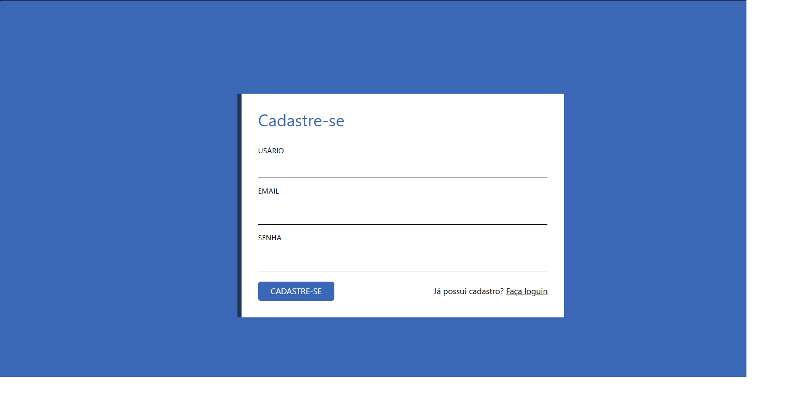
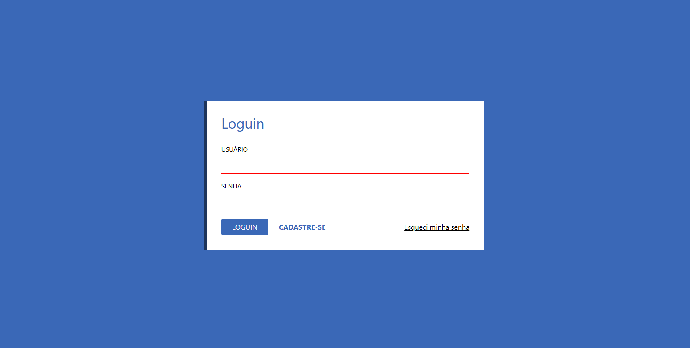

# Projeto Cadastro/Login

### 📝 Descrição

Simples aplicação simulando telas de loguin e cadastro. Feito com o intuito de praticar o uso de links entre documentos '.html' diferentes.

### 👀 Demonstração

#### Seção de Interação/Funcionalidade

**Seção de Interação/Funcionalidade | Cadastro**

Foco na parte central da página, a qual tem como objetivo simular uma tela de cadastro.



**Seção de Interação/Funcionalidade | Login**

Foco na parte central da página, a qual tem como objetivo simular uma tela de login.



### 💻 Tecnologias utilizadas

- HTML5
- CSS3

### 🎯 Objetivos de aprendizado

- Pratica ao uso de `HTML Attributes`.
- Pratica ao uso de links entre documentos `.HTML` diferentes.
- Reforço ao uso das diferentes propriedades de `transition`.
- Aplicação da tag `form` com HTML5.

### 📲 Instalação

1. Clone o repositório:

```bash
git clone https://github.com/Murilo-front/Cadastro-Login.git meu-projeto
```

2. Acesse a pasta do projeto:

```bash
cd meu-projeto
```

3. Abra o arquivo index.html no navegador:

- Clique duas vezes no arquivo ou

- Use um editor como o Visual Studio Code e a extensão Live Server.
